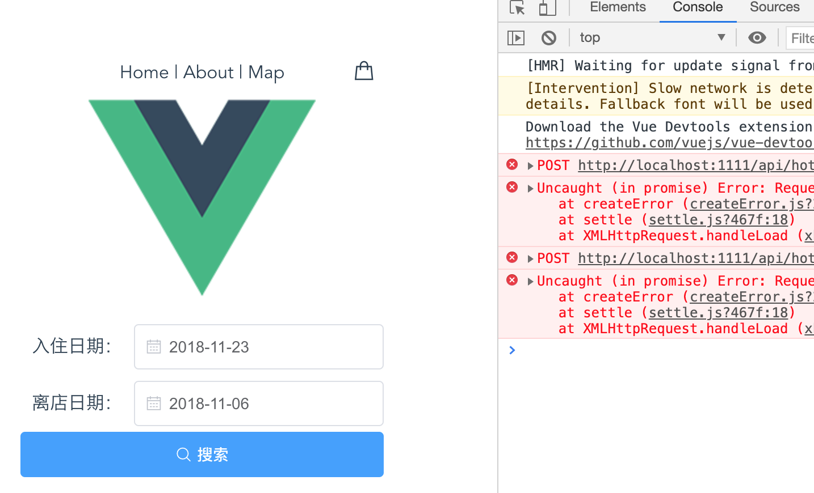

# HotelApp

### 启动

#### Vue-Cli

```shell
npm install -g @vue/cli
```

https://cli.vuejs.org/

1. 下载HotelApp源码
2. 在根目录 `npm install`
3. 在根目录 `npm run serve` 或 `vue ui` 打开（推荐）



只有初始界面，执行搜索会提示没有后台

#### MySQL

本地安装MySQL，导入sql

1. `create database hotel_data;`
2. `mysql -u root -p hotel_data < {path to server/hotel_data.sql}` 


**注意事项**

- root 123123123
  - 统一mysql账户名密码，或者自己每次 git pull 后，自己改

- select * from \`order\`;
  - 加反引号用于区分 order by 的保留关键字


#### Express

正常运行流程：

1. MySQL运行
2. `node server/index.js` 启动后端
3. `vue ui` 启动前端开发（任务 - serve）

